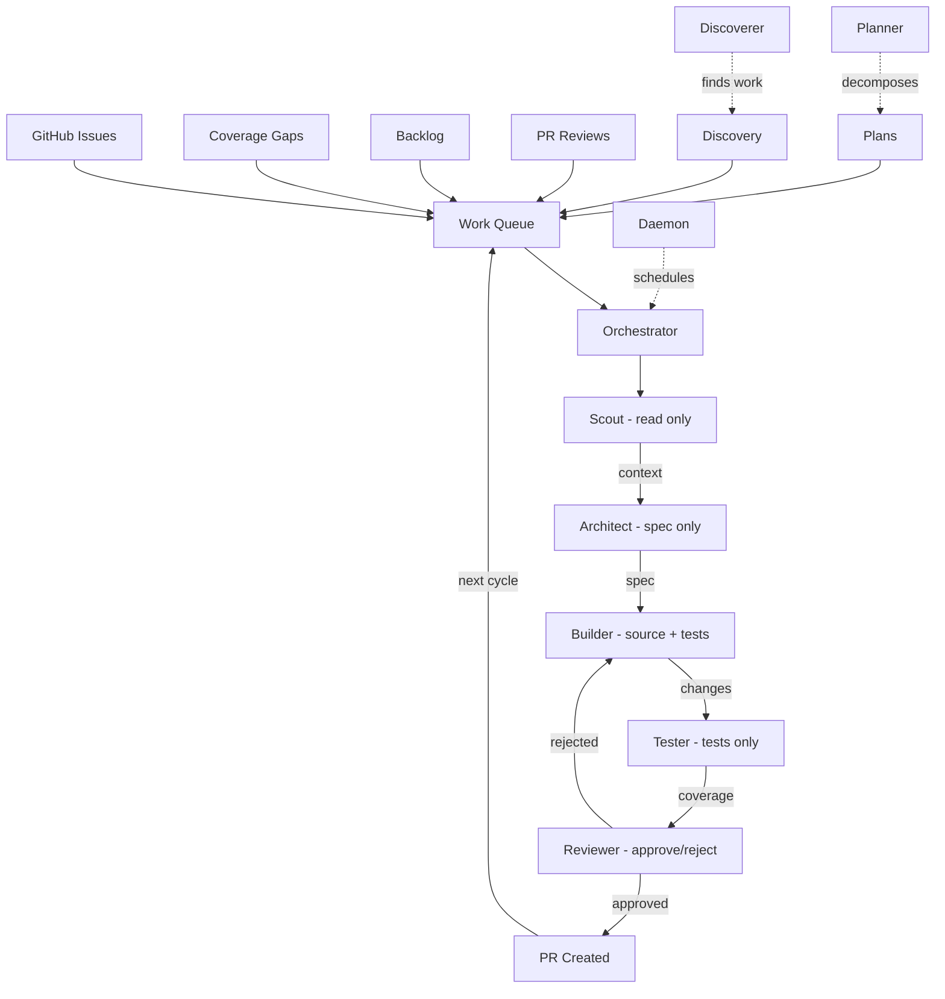

# AutoCode

[](https://opensource.org/licenses/MIT)
[](https://docs.anthropic.com/en/docs/claude-code)

> Your repo's engineering department. Features, bugs, coverage, refactoring — from a unified work queue. Zero dependencies. Just Claude Code.

A team of 7 constrained AI agents pull from a unified work queue — GitHub Issues, coverage gaps, backlog tasks, PR reviews, multi-PR plans, and proactively discovered work — and run the full pipeline: Scout → Architect → Builder → Tester → Reviewer → Ship. Runs interactively or as a scheduled daemon via GitHub Actions.

Inspired by [Karpathy's autoresearch](https://x.com/karpathy/status/1886192184808149383). Built for [Claude Code's auto-accept mode](https://docs.anthropic.com/en/docs/claude-code).

## Prerequisites

- [Claude Code](https://docs.anthropic.com/en/docs/claude-code) installed and configured
- Git repository with existing test infrastructure
- Auto-accept mode enabled (required for autonomous operation):
  - **Interactive**: Press `Shift+Tab` in Claude Code to toggle auto-accept mode
  - **CI/Daemon**: Use `claude -p --dangerously-skip-permissions` (see [Daemon Mode](#daemon-mode))
  - **Budget safety**: AutoCode has built-in budget controls ($5/session default) — auto-accept won't cause runaway spending

## Quick Start

```bash
# 1. Clone
git clone https://github.com/ajsai47/autocode.git
cd autocode

# 2. Install (symlinks skills into ~/.claude/)
./install.sh

# 3. Navigate to your project
cd ~/your-project

# 4. Bootstrap — analyzes your repo, generates a manifest
# (in Claude Code)
/autocode-bootstrap

# 5. Enable auto-accept (Shift+Tab), then run the factory
/autocode
```

## How It Works



## Architecture

### Manifest-Driven

The `autocode.manifest.json` is the contract. The bootstrap command (`/autocode-bootstrap`) analyzes your repo once and writes it down. Agents don't discover -- they read the manifest.

### Constrained Agents

Each agent has strict boundaries:

| Agent | Can Read | Can Write | Model |
|-------|----------|-----------|-------|
| Scout | Everything | Nothing | Sonnet |
| Architect | Everything | Specs only | Sonnet |
| Planner | Everything | Nothing | Sonnet |
| Builder | Everything | Source files only | Opus |
| Tester | Everything | Test files only | Sonnet |
| Reviewer | Everything | Nothing | Opus |
| Discoverer | Everything | Nothing | Sonnet |

### Progressive Difficulty

Starts with easy wins, graduates to harder tasks:

1. Simple tests — pure function coverage
2. Standard tests — utility coverage with light mocking
3. Bug fixes — coverage + bugfix from issues
4. Integration work — services, handlers, small features
5. Feature work — features, refactoring from issues
6. Complex changes — all work types enabled

### Multi-PR Planning

Large tasks get decomposed into dependency graphs of atomic PRs:
- Use `/autocode-plan "Add auth"` to decompose into types → middleware → routes → tests
- Each step is a separate PR with `blocked_by` dependencies
- The orchestrator respects the dependency graph automatically

### Daemon Mode

Run AutoCode 24/7 via GitHub Actions:
- `/autocode-daemon setup` generates a workflow with cron schedule
- Budget controls prevent runaway spending ($10/day default)
- State persists across runs via Actions cache
- Notifications on failure via GitHub Issues

### Proactive Discovery

AutoCode finds work without being told:
- Untested commits from teammates
- Complexity hotspots (files > 300 lines with high churn)
- Vulnerable dependencies (npm/pip/cargo audit)
- Stale TODOs older than 30 days

### Persistent Brain

Per-repo memory in `.autocode/memory/` that gets smarter over time:
- `knowledge.json` -- codebase knowledge graph (caches file analysis across sessions)
- `patterns.json` -- weighted pattern database (scored by success rate + recency)
- `ci_patterns.json` -- CI failure patterns and fix history
- `feedback_log.json` -- tracks ingested human PR feedback
- `fixes.md` / `failures.md` / `velocity.md` / `coverage.md` / `lessons.md` / `costs.md` -- cycle-by-cycle records

## Commands

| Command | Description |
|---------|-------------|
| `/autocode-bootstrap` | Analyze repo and generate manifest |
| `/autocode` | Run the autonomous code factory |
| `/autocode-status` | View current factory status and metrics |
| `/autocode-stop` | Gracefully stop the factory |
| `/autocode-focus` | Manage the priority work queue |
| `/autocode-next` | Preview the next cycle (dry run) |
| `/autocode-plan` | Decompose large tasks into multi-PR plans |
| `/autocode-daemon` | Manage daemon mode (setup, status, pause, resume) |
| `/autocode-discover` | Run proactive codebase discovery |
| `/autocode-report` | Generate a shareable summary of factory results |

## Guardrails

- **Immutable files**: Config files, env files, CI workflows, and the manifest itself are never touched
- **PR size limits**: Max 5 files, 200 lines changed per PR
- **Worktree isolation**: Every cycle runs in its own git worktree
- **CI-aware shipping**: If CI fails after merge, AutoCode reads logs, categorizes the failure, and attempts to fix before reverting
- **Diminishing returns**: Pauses when improvements plateau

## Configuration

See [docs/customization.md](docs/customization.md) for manifest tuning.

## Examples

- [TypeScript Monorepo](examples/typescript-monorepo.json)
- [Python FastAPI](examples/python-fastapi.json)
- [Rust CLI](examples/rust-cli.json)
- [Go API](examples/go-api.json)

## Troubleshooting

**"No test command detected"**
Specify your test command explicitly in `autocode.manifest.json` under `commands.test`. The bootstrap step infers it, but some repos need manual configuration.

**"Coverage not available"**
Run `/autocode-bootstrap` to install coverage tooling. AutoCode needs a coverage reporter to track progress and select targets.

**"Agent fails with API error"**
This is typically a model routing issue. Switch the failing agent's model from `haiku` to `sonnet` in the manifest. Haiku sometimes lacks the context window for large files.

**"Worktree conflicts"**
Stale worktrees from interrupted cycles can cause conflicts. Clean them up with:
```bash
git worktree prune
```

## FAQ

**How much does it cost?**
Depends on the models you configure. Expect ~$0.50-2.00 per cycle with an Opus builder, or ~$0.10 per cycle with Sonnet everywhere.

**What languages are supported?**
Any language with a test runner. Best support for TypeScript, Python, Rust, and Go.

**Can it break my code?**
Every change runs in an isolated git worktree. Failed cycles are cleaned up automatically. PRs are created for review before merging -- nothing lands on `main` without your approval.

**Can it implement features?**
Yes, at Level 3+ with GitHub Issues integration enabled. Create an issue with the `autocode` label and a `feature` or `bug` label. AutoCode will pick it up, design a spec, implement it, test it, and ship a PR.

**What work sources does it support?**
Coverage gaps (default), GitHub Issues (opt-in), `.autocode/backlog.md` (manual tasks), PR review responses (auto), multi-PR plans (via `/autocode-plan`), proactive discovery (opt-in), and TODO/FIXME scanning (opt-in). Use `/autocode-focus` to override priorities.

**Can it run unattended?**
Yes. Use `/autocode-daemon setup` to generate a GitHub Actions workflow that runs on a cron schedule with budget controls. State persists across runs via Actions cache. Configure notifications for failures and budget alerts.

**Can it handle multi-step features?**
Yes. Use `/autocode-plan "Add authentication"` to decompose the task into a dependency graph of atomic PRs. The Planner agent breaks it down into types → middleware → routes → tests, each as a separate PR with proper ordering.

**Does it learn from my feedback?**
Yes. When you review and merge (or close) an AutoCode PR with comments, the orchestrator extracts patterns from your feedback and uses them to improve future cycles. The pattern database tracks success rates and recency so the most useful patterns surface first.

**What happens when CI fails after merge?**
AutoCode reads the CI logs, categorizes the failure, and attempts to fix it (up to 2 attempts by default). If the fix works, it ships a `ci-fix` PR. If not, it falls back to reverting. CI failure patterns are tracked so future fixes get smarter. Set `ci.auto_fix: false` in the manifest for the old behavior (immediate revert).

**How do I customize it?**
Edit `autocode.manifest.json` or the agent files directly. See [docs/customization.md](docs/customization.md) for details.

## Requirements

- [Claude Code](https://docs.anthropic.com/en/docs/claude-code) with auto-accept enabled (`Shift+Tab` in interactive mode, `--dangerously-skip-permissions` for CI)
- Git repository with existing test infrastructure
- No dependencies, no build step — pure Claude Code skill files

## License

MIT
