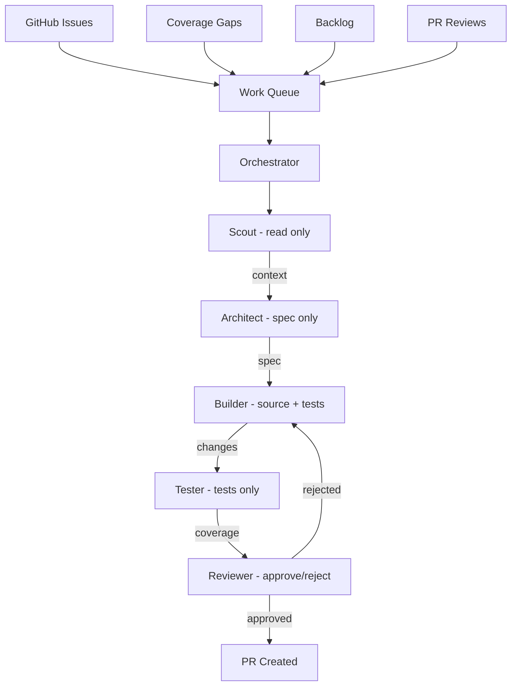

# AutoCode

[](https://opensource.org/licenses/MIT)
[](https://docs.anthropic.com/en/docs/claude-code)

> Your repo's engineering department. Features, bugs, coverage, refactoring — from a unified work queue. Zero dependencies. Just Claude Code.

A team of 5 constrained AI agents pull from a unified work queue — GitHub Issues, coverage gaps, backlog tasks, PR reviews — and run the full pipeline: Scout → Architect → Builder → Tester → Reviewer → Ship. All unattended.

Inspired by [Karpathy's autoresearch](https://x.com/karpathy/status/1886192184808149383). Built for [Claude Code's auto-accept mode](https://docs.anthropic.com/en/docs/claude-code).

## Quick Start

```bash
# 1. Clone
git clone https://github.com/ajsai47/autocode.git
cd autocode

# 2. Install (symlinks skills into ~/.claude/)
./install.sh

# 3. Navigate to your project
cd ~/your-project

# 4. Bootstrap — analyzes your repo, generates a manifest
# (in Claude Code)
/autocode-bootstrap

# 5. Run the factory
/autocode
```

## How It Works



## Architecture

### Manifest-Driven

The `autocode.manifest.json` is the contract. The bootstrap command (`/autocode-bootstrap`) analyzes your repo once and writes it down. Agents don't discover -- they read the manifest.

### Constrained Agents

Each agent has strict boundaries:

| Agent | Can Read | Can Write | Model |
|-------|----------|-----------|-------|
| Scout | Everything | Nothing | Sonnet |
| Architect | Everything | Specs only | Sonnet |
| Builder | Everything | Source files only | Opus |
| Tester | Everything | Test files only | Sonnet |
| Reviewer | Everything | Nothing | Opus |

### Progressive Difficulty

Starts with easy wins, graduates to harder tasks:

1. Simple tests — pure function coverage
2. Standard tests — utility coverage with light mocking
3. Bug fixes — coverage + bugfix from issues
4. Integration work — services, handlers, small features
5. Feature work — features, refactoring from issues
6. Complex changes — all work types enabled

### Memory System

Per-repo memory in `.autocode/memory/` prevents loops and accumulates knowledge:
- `fixes.md` -- what was fixed and how
- `failures.md` -- what didn't work (don't retry)
- `velocity.md` -- PRs shipped, merge rates, timing
- `coverage.md` -- per-file coverage progression
- `lessons.md` -- patterns that work, patterns that fail
- `costs.md` -- per-cycle cost estimates and running totals

## Commands

| Command | Description |
|---------|-------------|
| `/autocode-bootstrap` | Analyze repo and generate manifest |
| `/autocode` | Run the autonomous code factory |
| `/autocode-status` | View current factory status and metrics |
| `/autocode-stop` | Gracefully stop the factory |
| `/autocode-focus` | Manage the priority work queue |
| `/autocode-next` | Preview the next cycle (dry run) |
| `/autocode-report` | Generate a shareable summary of factory results |

## Guardrails

- **Immutable files**: Config files, env files, CI workflows, and the manifest itself are never touched
- **PR size limits**: Max 5 files, 200 lines changed per PR
- **Worktree isolation**: Every cycle runs in its own git worktree
- **Auto-revert**: If CI fails after merge, AutoCode reverts its own PR
- **Diminishing returns**: Pauses when improvements plateau

## Configuration

See [docs/customization.md](docs/customization.md) for manifest tuning.

## Examples

- [TypeScript Monorepo](examples/typescript-monorepo.json)
- [Python FastAPI](examples/python-fastapi.json)
- [Rust CLI](examples/rust-cli.json)
- [Go API](examples/go-api.json)

## Dogfood Results

First run against [Ghost v2](https://github.com/ajsai47/ghostv2) (TypeScript monorepo, 1005 tests):

| Cycle | Target | Tests Added | Duration | PR |
|-------|--------|-------------|----------|-----|
| 1 | `page-tree.ts` | 69 | ~3 min | [#25](https://github.com/ajsai47/ghostv2/pull/25) |
| 2 | `heuristic-generator.ts` | 79 | ~7 min | [#26](https://github.com/ajsai47/ghostv2/pull/26) |
| 3 | `adaptive-selector.ts` | 27 | ~2 min | [#27](https://github.com/ajsai47/ghostv2/pull/27) |
| 4 | `tinyfish-executor.ts` | 35 | ~5 min | Pending |
| 5 | `http-executor.ts` | 51 | ~8 min | Pending |
| 6 | `tool-generator.ts` | 33 | ~5 min | Pending |

**294 tests shipped across 6 cycles, 100% success rate, Level 1 --> Level 2.**

## Troubleshooting

**"No test command detected"**
Specify your test command explicitly in `autocode.manifest.json` under `commands.test`. The bootstrap step infers it, but some repos need manual configuration.

**"Coverage not available"**
Run `/autocode-bootstrap` to install coverage tooling. AutoCode needs a coverage reporter to track progress and select targets.

**"Agent fails with API error"**
This is typically a model routing issue. Switch the failing agent's model from `haiku` to `sonnet` in the manifest. Haiku sometimes lacks the context window for large files.

**"Worktree conflicts"**
Stale worktrees from interrupted cycles can cause conflicts. Clean them up with:
```bash
git worktree prune
```

## FAQ

**How much does it cost?**
Depends on the models you configure. Expect ~$0.50-2.00 per cycle with an Opus builder, or ~$0.10 per cycle with Sonnet everywhere. A full 6-cycle dogfood run cost roughly $5.

**What languages are supported?**
Any language with a test runner. Best support for TypeScript, Python, Rust, and Go.

**Can it break my code?**
Every change runs in an isolated git worktree. Failed cycles are cleaned up automatically. PRs are created for review before merging -- nothing lands on `main` without your approval.

**Can it implement features?**
Yes, at Level 3+ with GitHub Issues integration enabled. Create an issue with the `autocode` label and a `feature` or `bug` label. AutoCode will pick it up, design a spec, implement it, test it, and ship a PR.

**What work sources does it support?**
Coverage gaps (default), GitHub Issues (opt-in), `.autocode/backlog.md` (manual tasks), PR review responses (auto), TODO/FIXME scanning (opt-in). Use `/autocode-focus` to override priorities.

**How do I customize it?**
Edit `autocode.manifest.json` or the agent files directly. See [docs/customization.md](docs/customization.md) for details.

## Requirements

- [Claude Code](https://docs.anthropic.com/en/docs/claude-code) with auto-accept enabled
- Git repository with existing test infrastructure
- No dependencies, no build step -- pure Claude Code skill files

## License

MIT
